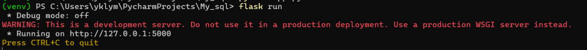
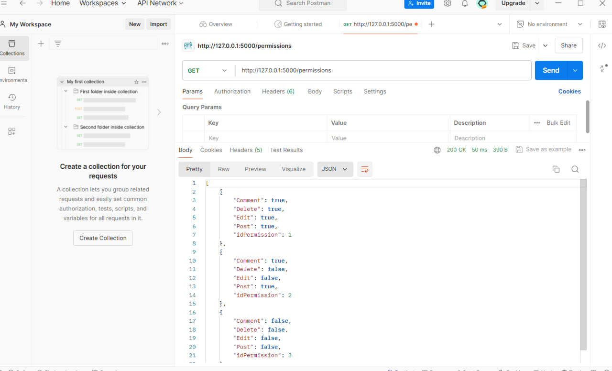
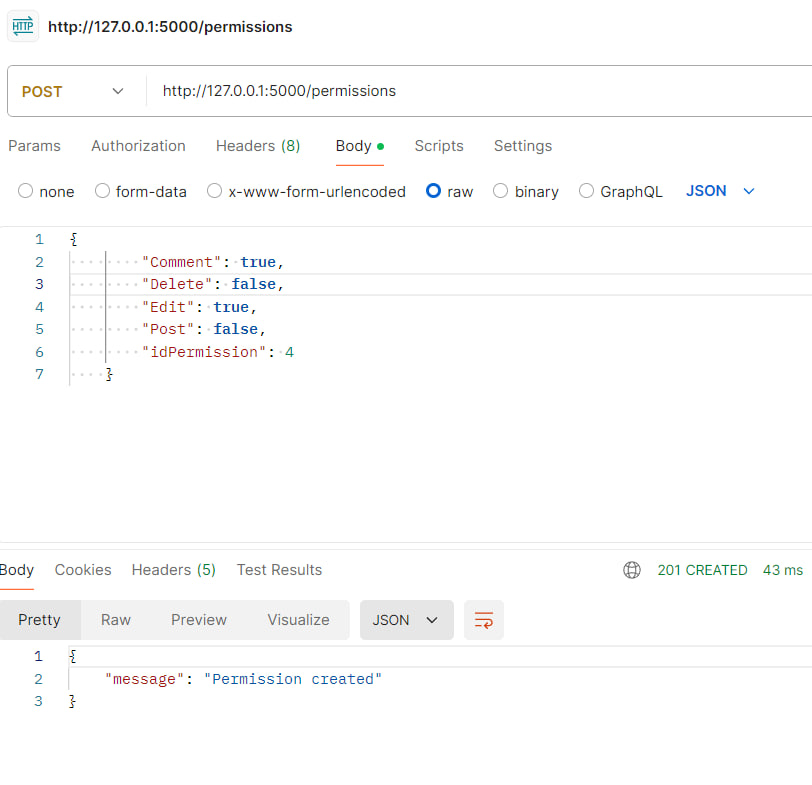
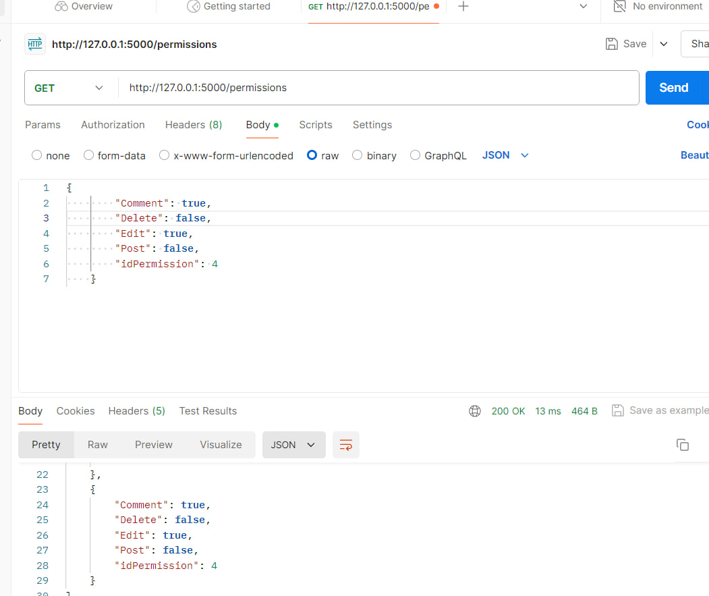
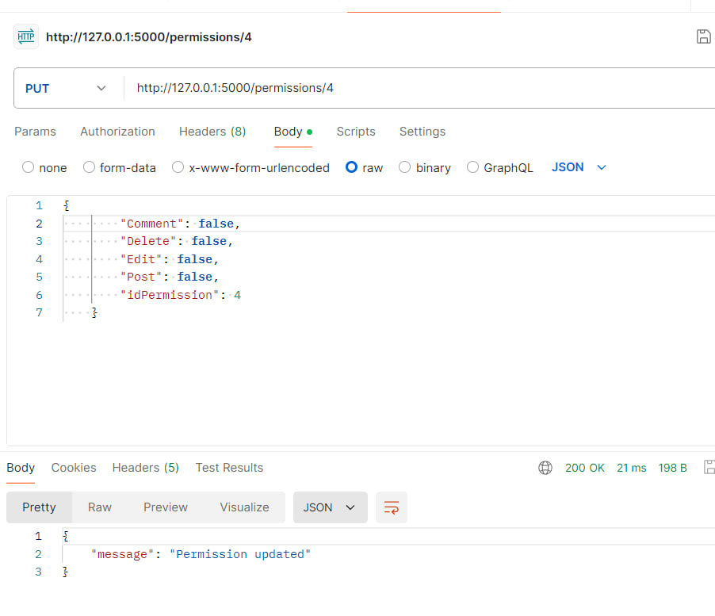
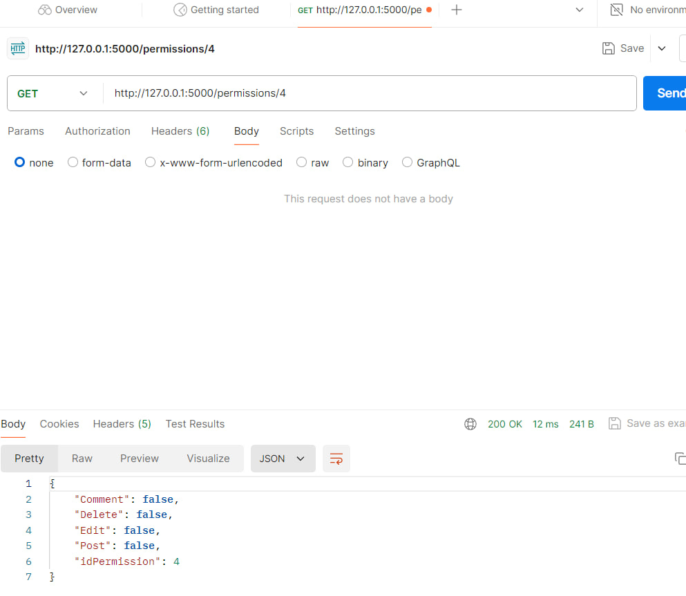
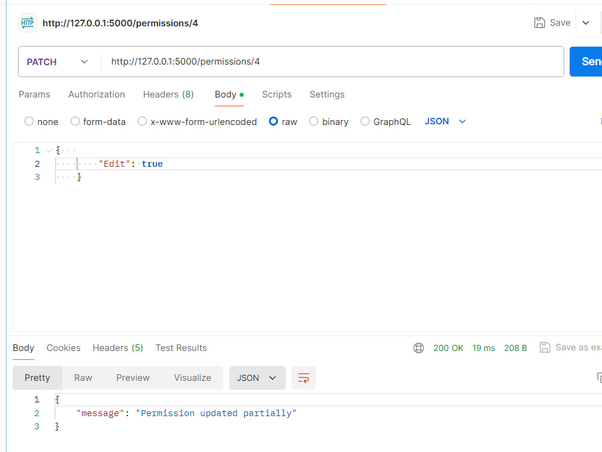
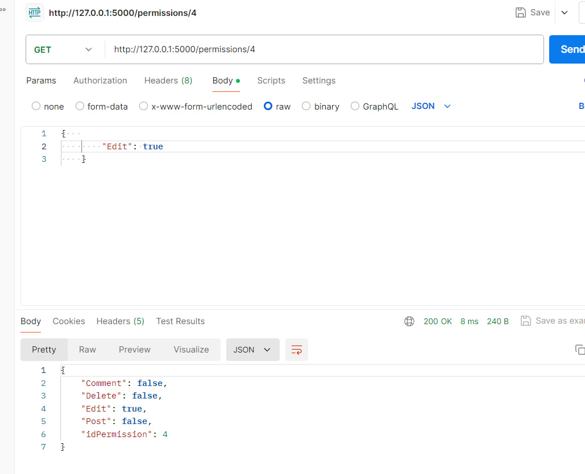
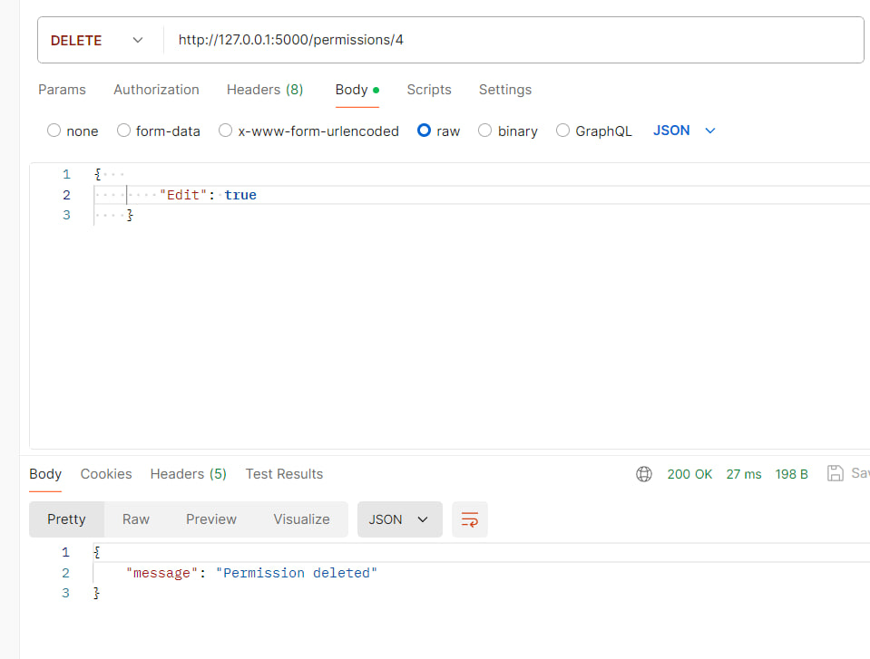
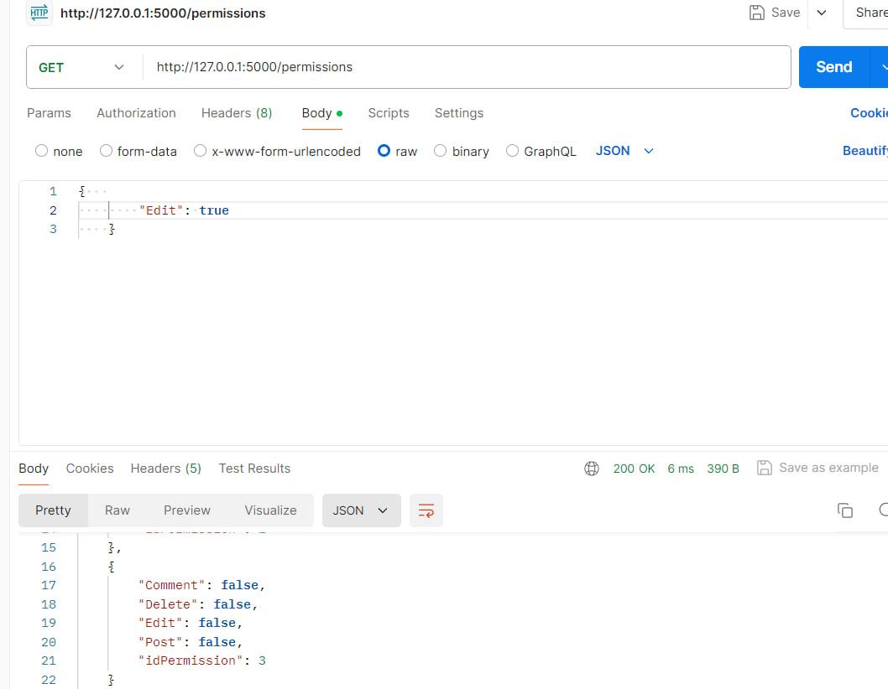

# Тестування працездатності системи
Для тестування системи використовувся додаток Postman
## Запуск сервера
 
 
## Метод GET
 

## Метод POST
 

### Перевірка за допомогою GET
 
 
## Метод PUT
 

### Перевірка за допомогою GET
 

 ## Метод PATCH
  

### Перевірка за допомогою GET
 

 ## Метод DELETE
 

### Перевірка за допомогою GET
 